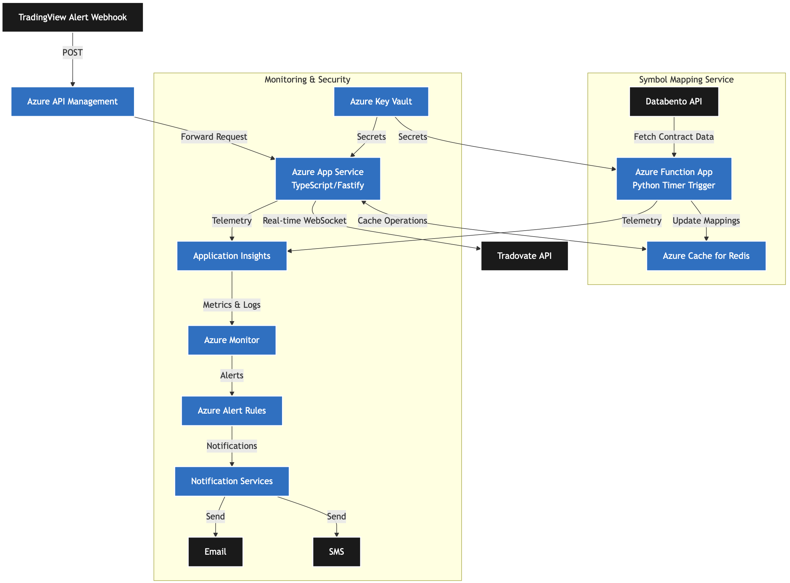

# Trading Backend Service

## Overview

A high-performance WebSocket-based trading service that connects TradingView signals to Tradovate for automated futures trading. Built with Node.js, TypeScript, and Fastify, this service provides real-time order execution with robust error handling and monitoring.

## Architecture

### Architecture Decisions

- Fastify for high-performance HTTP and WebSocket handling
- Redis for fast symbol mapping lookups
- Azure App Service for reliable hosting
- Terraform for infrastructure as code
- TypeScript for type safety and maintainability

#### Architecture Diagram



### Core Components

- **WebSocket Server**: Maintains persistent connection with Tradovate for real-time trading
- **Webhook Endpoint**: Receives signals from TradingView
- **Redis Cache**: Stores contract mappings and session data
- **Azure Key Vault**: Secures sensitive credentials
- **Application Insights**: Provides monitoring and telemetry

### Tech Stack

- Runtime: Node.js 20
- Framework: Fastify
- Language: TypeScript
- Cache: Redis
- Monitoring: Azure Application Insights
- Infrastructure: Azure (IaC with Terraform)

## Features

- Real-time WebSocket connection to Tradovate
- Automatic contract mapping between TradingView and Tradovate symbols
- Secure credential management via Azure Key Vault
- Comprehensive logging and monitoring
- Automated deployment via GitHub Actions
- Infrastructure as Code using Terraform
- High test coverage with Vitest

## Prerequisites

- Node.js 20+
- pnpm
- Redis
- Azure subscription
- Tradovate account
- TradingView Pro+ account

## Installation

```bash
# Clone the repository
git clone https://github.com/yourusername/trading-backend.git

# Install dependencies
pnpm install

# Set up environment variables
cp .env.example .env
# Edit .env with your configuration
```

## Configuration

Configure the following environment variables:

```bash
# Azure
KEYVAULT_URI=https://your-keyvault.vault.azure.net/
APPINSIGHTS_INSTRUMENTATION_KEY=your_key

# Trading
TRADOVATE_WS_URL=wss://live.tradovateapi.com/v1/websocket
TRADOVATE_ACCOUNT_ID=your_account_id

# Redis
REDIS_CONNECTION_STRING=your_connection_string

# CORS
ALLOWED_ORIGINS=http://localhost:3000
```

## Development

```bash
# Run in development mode
pnpm dev

# Run tests
pnpm test

# Run tests with coverage
pnpm test:coverage

# Build for production
pnpm build

# Start production server
pnpm start
```

## Deployment

The service is deployed using GitHub Actions and Terraform. The deployment process includes:

- Infrastructure deployment (Terraform)
- Application deployment (Azure App Service)
- Function deployment (Azure Functions)

## Infrastructure

```bash
# Initialize Terraform
terraform init

# Plan changes
terraform plan

# Apply changes
terraform apply
```

## API Documentation

### Webhook Endpoint

#### POST /webhook

```json
{
  "symbol": string,
  "side": string,
  "quantity": number,
  "price": float
}
```

### Health Check

#### GET /health

```json
{
    "status": "OK",
    "uptime": 11.872356791,
    "timestamp": "2024-10-27T05:11:32.863Z"
}
```

## Testing

The project includes:

- Unit tests
- Integration tests
- E2E tests
- Test coverage reporting

```bash
# Run all tests
pnpm test

# Run with coverage
pnpm test:coverage
```

## Monitoring

Application metrics via Azure Application Insights
Custom alerts for:

- Trading failures
- High latency
- WebSocket disconnections
- Redis connection issues

## Security

- All credentials stored in Azure Key Vault
- CORS protection
- Rate limiting
- Input validation
- Secure WebSocket connections
